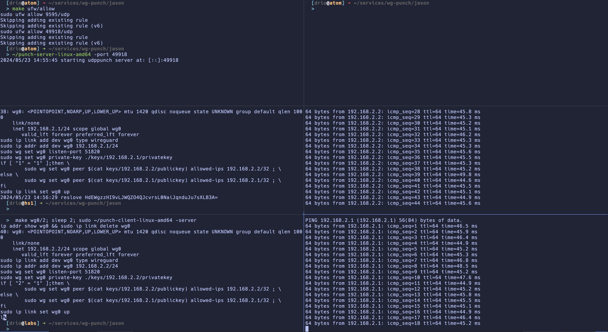

<h2 align="center">udp punch</h2> 
<p align="center">
  
</p>

Fork from [natpunch-go](https://github.com/malcolmseyd/natpunch-go). 
I modified the code slightly to make easier to test so 
I could understand the code better.
The code "punches holes" in NAT/firewall devices to allow peers in a
wireguard network to connect to each other directly.

You start the server. The server listens for udp traffic in a port you 
specify. 

You setup [wireguard](https://www.wireguard.com/quickstart/) in the peers
you want to connect. You setup everything with the exception of the endpoint.
That is the part that the client in this project will setup for you. After
setting up wg, you start the client in each of the peers. The client will 
connect to the server and send its public key. The server will store that 
and also the public side/view of the peer. The server will broadcast this 
information to the other peers in the network. When the client receives the 
list of peers (public keys and endpoints) it uses that to finish the configuration
of the wireguard interface. 

If all goes well, you end up with secure, direct end to end encrypted wireguard
connections between peers. 

Fantastic.


## usage

server side

```bash
./punch-server-linux-amd64 -port 19993
```

client side

> make sure wireguard is up

```bash
./dist/punch-client-linux-amd64 -server xxxx:19993 -iface wg0
```

## resource

- [natpunch-go](https://github.com/malcolmseyd/natpunch-go) (because of [#7](https://github.com/malcolmseyd/natpunch-go/issues/7) not support macOS, so I build this)
- [wireguard-vanity-address](https://github.com/yinheli/wireguard-vanity-address) generate keypairs with a given prefix
- [UDP hole punching](https://en.wikipedia.org/wiki/UDP_hole_punching)
